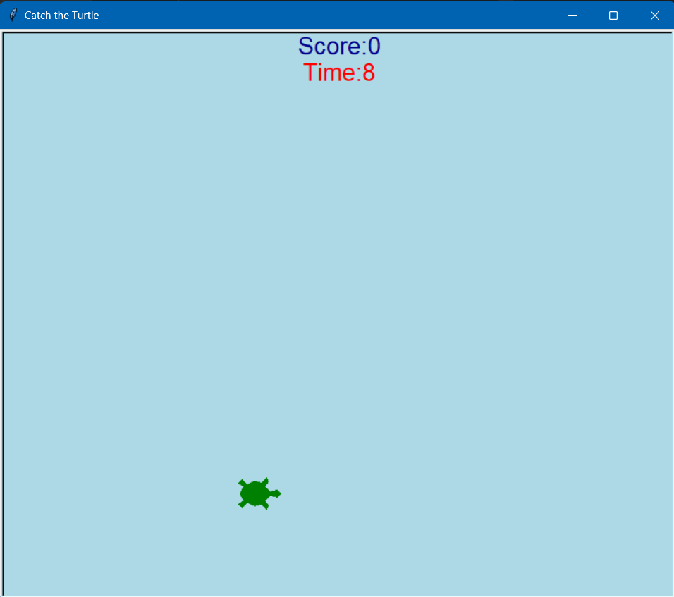

# Catch the Turtle Game

Catch the Turtle is a simple Python turtle graphics game where you try to catch randomly appearing turtles by clicking on them. Your score increases with each successful catch, and you have a limited amount of time to catch as many turtles as you can.

## How to Play

1. Clone the project to your computer or download it as a zip file.

2. Make sure you have Python and the Turtle graphics library installed.

3. Run the game by executing the `catch_the_turtle.py` file.

4. You will see turtles of various colors appear randomly on the screen.

5. Click on a turtle to catch it. Your score will increase.

6. You have a limited amount of time to catch as many turtles as possible.

7. The game ends when the countdown timer reaches zero.

8. Try to achieve the highest score and have fun!
